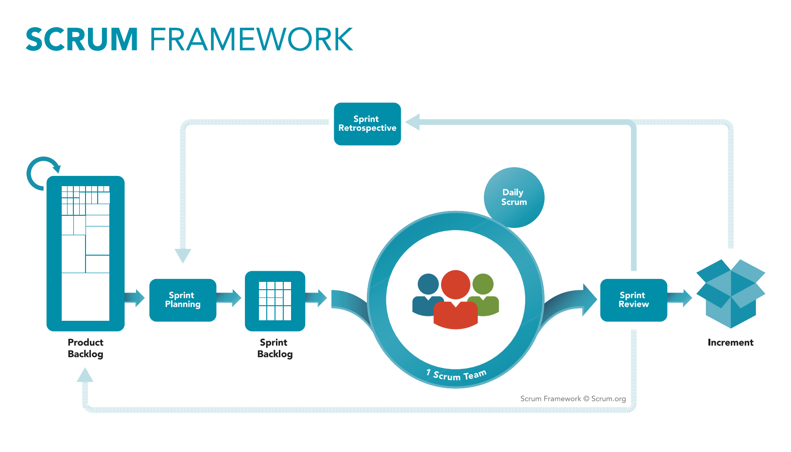

# ScrumFramework 와 구성원

Agile 하면 대표적으로 떠오르는 것이 Scrum Framework 입니다.

스크럼은 팀원들이 럭비의 스크럼을 짜듯이 어깨를 걸고 목표를 위해서 서로 의견을 모으고, 함께 팀웍으로 움직인다는 개념으로 탄생 되었습니다.

## Scrum Framework

어떤 사람들은 스크럼을 방법론이라고 부릅니다. 그러나 사실 Agile 에서는 방법론이라고 부르지 않습니다. 

방법론이라고 이름을 붙이는 순간 Agile 의 의미를 퇴색시킵니다. 

방법론은 특정한 문제를 해결하기 위해서 사용되는 일련의 절차를 말합니다. 이는 무엇을 어떻게 해야하는지를 제시하는데 목표를 두고 있습니다. 

그러나 Scrum 은 방법론이라고 하지 않고 프레임워크라고 부릅니다. 

프레임워크는 특정한 롤과 도구들을 가지고 있지만, 방법론보다 유연하며, 방법론을 꼭 따르는 것이 아니라, 프로젝트와 팀에 맞게 찾아가는데 그 의미를 둡니다. 

## Scrum Overview

from: https://www.scrum.org

위 그림에서 보는바와 같이 Scrum Framework는 다음과 같습니다. 

- Product Backlog: 제품 백로그, 제품에서 구현하고자 하는 큰 작업 목록을 타나냅니다. 
- Sprint Planning: 제품 백로그로 부터 우선순위가 가장 높은 것들을 뽑아서 스프린트 플래닝을 통해서 구체화 합니다. 
- Sprint Backlog: 스프린트 백로그는 이번 스프린트 동안에 수행할 작업 목록입니다. (Task List)
- Sprint: 스프린트는 보통 1 ~ 4주 기간을 잡아서 수행합니다. 스프린트는 이름에서와 같이 개발팀이 전력질주하여 제품을 만들어 냅니다. 
    - Daily Scrum: 데일리 스크럼은 어제한일, 오늘할일, 이슈 를 각자 이야기하는 일종의 초간단 미팅입니다. 데일리 스탠딩이라고도 합니다. 
- Sprint Review: 스프린트 리뷰는 스프린트 동안 개발된 산출물을 시연하는 장입니다. 이날을 위해서 한 스프린트를 전력질주 하는 것이지요
- Sprint Retropective: 스프린트 회고는 이번 스프린트를 돌아보면서 팀의 작업 문화를 개선하는 매우 귀중한 시간입니다. 

개략적으로 스크럼은 위의 과정을 반복적으로 수행하며, 원하는 제품을 스프린트 사이클을 진행하면서 개선하고, 추가해 내가게 됩니다. 

## Scrum 구성원

- Product Owner(PO): PO 는 제품의 책임자입니다. 이들의 목적은 제품의 주인으로 제품에 대한 총괄 책임자 입니다. 
    - 제품 백로그 관리 (우선순위조정 및 구체화)
    - 클라이언트와 회의를 통해서 제품 백로그를 구체화해 나갑니다. 
    - 제품의 출시 계획을 결정하고 운영 유지
    - 데이터를 기반으로 의사결정을 수행합니다. 
- Scrum Master(SM): 스크럼 마스터는 스크럼 프레임워크 구성원중 가장 폭넓고 중요한 일을 하는 역할입니다. 
    - PO 와 협업하여 제품 백로그 관리에 도움
    - 스프린트 백로그 관리
        - 스크럼 보드 갱신
        - 번다운 차트 작성
    - 개발팀의 생산성 촉진
        - 개발팀과 PO 사이에 교량역할
        - 개발 방해물 모니터링 및 제거
    - 스프린트 플래닝, 데일리 스크럼, 리뷰, 회고 등의 원활한 준비 및 진행
    - 스크럼 지식의 전파 및 개발 문화의 조성, 확산
- Developer: 스크럼에서 개발자는 프로그래머만을 이야기하지 않고 제품을 만드는 모든 사람을 말합니다. 
    - 자율적인 조직으로 구성됨
    - 자신 분야의 전문가로, 팀원과 함께 협업을 통해 제품을 생산 

## 실질적인 문제들

지금까지 나열한 스크럼의 개요라든지, 구성원들은 스크럼의 아키텍처적인 부분입니다. 

이것을 이용하여 실제 스크럼을 해보면 정말 잘 진행이 되지 않음을 알 수 있습니다. 

저의 경험을 바탕으로 기술하는 것이기 때문에 모든것을 담지 못할 것이고, 또한 충분한 해결책이 존재하는 이슈일 수도 있습니다. 

이런 한계를 이해해 주시기 바랍니다. 

몇가지 문제들에 대해서 한번 알아보겠습니다. 

### 진짜 PO, 가짜 PO

저의 경험상 대부분의 PO 는 가짜 PO 입니다. 

어째서 그런것일 까요? 

애자일이 인기가 있고, 애자일 프레임워클르 도입하면서 PO 들로 대부분 기획자가 그 롤을 맏았습니다. 

기획자가 잘못됬다는 것이 아니라, Agile 에서 PO의 권한의 한계로 인한 문제가 많았다는 것입니다.

기획자는 일반적으로 제품을 기획하고, 임원 혹은 팀장의 승인을 받고 기획서를 만들어 전달하고, 제품을 만드는 과정에서 개발팀과 상화작용을 합니다. 

그러나 제품 백로그를 관리한다거나, MVP(Minimum Viable  Product)를 정의하거나, 기획서 상에서 필요 없는 부분을 과감히 제거하는 행위를 잘 하지 않습니다. 

제품은 언제든지 상위 조직장의 마인드에 의해서 바로 바뀌거나, 그들의 요구를 개발자들에게 바로 전달하는 행위를 합니다. 

그리고 무엇보다 중요한 것은 시장의 변화에 주목하지 않는다는 것입니다. 기획한 대로 제품을 만들어 내는데 열과 성의를 쏟는다는 것입니다. 

그러나 진자 PO 는 위와 약간 다릅니다. 

사업의 핵심을 관통하는 MVP 를 선정하고, MVP 개발을 위한 제품 백로그를 관리합니다. 

이 제품 백로그에는 MVP 에서 계속해서 확장해 나가거나, 제거해야할 기능들의 목록입니다. 

또한 PO 는 데이터를 이용합니다. 현재의 제품의 status 를 확인하고, 제품의 데이터를 수집합니다. 그리고 앞으로 출시될 기능이 현재 제품에 어떠한 영향을 줄 것인지를 기대하는 목표치를 가지고 있습니다. 그리고 실제 오픈한 제품의 기능들을 수치화여 제품 백로그에 우선순위 조정에 이용하기도 합니다. 

이런 데이터를 본다는 의미는 시장의 변화를 분석한다는 의미입니다. 

변화의 분석 결과가 제품 백로그로 반영이 되는 것이지요. 

물론 PO의 권한이 기존 기획자보다 권한이 많지만, 상위 조직장의 지시도 받아 들여집니다. 그러나 이들은 데이터를 가지고 있고, 백로그를 가지고 있기 때문에 협상을 할 수 있는 여지가 있습니다. 

간단하게 몇가지만 살펴 보았는데요, 제품의 주인이라는 의미가 그냥 주어진 것은 아닌것 같습니다. 

### 스크럼 마스터의 역할

Scrum 에서 스크럼 마스터의 역할은 아마도 성공과 실패를 가를만한 정도의 중요도를 가진다고 할 수 있습니다. 

스크럼 프레임워클르 도입하는 시작부터 스프린트, 제품출시, 운영 전반에서 스크럼 마스터는 자신의 역할이 존재합니다. 

스크럼 마스터의 덕목은 servant leadership 입니다. 아무나 할 수 없는 것입니다.

그러나 가끔 이렇게 중요한 스크럼 마스터의 롤을 의심하는 개발자 혹은 PO 가 생기기도 합니다.

#### 스크럼 마스터의 필요성 의심 

"저 사람은 프로젝트에서 왜 필요한거지?", "나는 이런 일을 하고 있는데 저 사람은 무슨일을 하고 있는거지?" 라고 생각할 정도로 잔업이 많이 있습니다. 

그러나 한가지 우리가 무시하는 것이 있습니다. 

모든일에는 노력과 시간이 들어간다는 것입니다. 심지어 컴퓨터를 하나 켜는데도 시간과 노력이 들어갑니다. 

스크럼 마스터가 대신해주기 때문에 보이지 않는 것일 수도 있습니다. 

- PO와 제품 백로그를 선정하기 위해 팀의 속도를 측정해야합니다. 
- 그리고 스프린트 플래닝을 주제하며, PO가 던진 제품 백로그 아이템을 스프린트 태스크로 분할 할 수 있도록 가이드 해주어야합니다. 
- 개발자가 스프린트를 방해없이 진행하기 위해서 촉진자의 역할을 수행합니다. 
    - 1on1 미팅
    - 기술적 이슈를 해결해 줄 수 있는 사람들과 연계
- 데일리 미팅 주제
    - 스크럼 보드 가이드
    - 번다운 차트로 스프린트 속도 측정 및 정보 방렬
- 스프린트 리뷰 준비 및 주제
- 회고 미팅 주제 및 발전적 문화를 위한 액션 아이템 도출 및 실천 가이드 
- 신규팀원 보딩
- 애자일 문화 확산

이런 일들 모두 개발자는 개발만 할 수 있도록, PO는 제품 성정을 위한 전략에 집중할 수 있도록 본인의 역할을 해주는 것입니다. 

어떻게 보면 이런것들을 스스로 하는 팀이 있을 수 있습니다. 

그러나 Scrum Master 가 수행하는 것 보다 생산적이지는 않습니다. 또한 개발팀 구성원 개개인이 작업하는 것은 신뢰성도 그리 높지 않습니다. 

보이지 않는다고 가치가 없어지는 것은 아니라는 것을 이해할 수 있어야합니다. 

#### 스크럼 마스터 권한과 역량을 넘어선 기대

스크럼 마스터 스스로 조직의 의사결정과 맞지 않는 문화를 개선하기 위한 노력을 하는 경우가 있습니다. 

상위 조직장이 애자일 하면 빠르게 제품이 만들어 진다며? 라는 마인드로 애자일을 도입하는 경우 혹은, 애자일 마인드가 정확히 탑재되지 않은경우

스크럼 마스터가 자신의 역할중에 하나인 애자일 문화 확산, 기법 도구등을 확신시키고자 노력할때 문제가 발생합니다. 

이런 문제에 봉착하면 스크럼 마스터는 포기하거나 진짜 스크럼을 수행하는 조직을 찾아 떠나게 됩니다.

이럴때 한발짝 떨어져서 볼 필요가 있습니다. 

현재 우리 조직에 맞게 커스터마이징 할 수 있는 방법을 논의하고 만들어 갈 필요가 있으며 동시에 애자일 마인드를 확산에 노력이 필요합니다. 

물론 쉬운일이 아닙니다. 그러나 회사의 기조나 정책과 배치되는 일은 어떻게 해도 바뀌지 않습니다. 

### 하루 노는날 회고?

스크럼이 성숙한 조직은 회고의 중요성을 잘 알고 있습니다. 

그러나 스크럼을 흉내내는 조직은 회고는 그냥 하루 반나절 정도 노는 날이 되어 버립니다. 

시시 껄렁한 이야기나 하고, 리뷰까지 달려온 시간에 대한 보상처름 느끼는 것입니다. 

그러나 회고는 스크럼 프레임워크를 진정 가치있는 프레임워크로 만들어 주는 중요한 시간입니다. 

회고에서는 Keep, Remove, Action 으로 분리해서 생각합니다. 

스크럼을 운영하기에 팀원이 유지하고, 더 강화해야하는 것은 Keep 란에 기입합니다.

스크럼을 진행하면서 방해요인이나, 제거해야할 문화등은 Remove 란에 기입합니다. 

그리고 이를 실천해야할 방법들 혹은 실천 사항들은 Action 에 추가하여 다음번 스프린트에 문화로 정착될 수 있도록 공표합니다. 

회고는 팀에 가장 잘 맞는 프레임워크로 커스터마이징 하는 기회라는 것을 꼭 기억하고 활용 해야합니다. 

### 플래닝 이슈

스크럼팀이 하나 있는 조직과 하나 이상인 조직은 운영방식도 달라야 합니다. 

이번 스프린트 플래닝을 할 때 PO 가 내려준 PBI(Product Backlog Item) 을 열심히 플래닝을 통해서 태스크로 작업했지만, 해당 작업은 외부 팀과의 의존성이 있는 작업이었습니다. (사실 이런일은 비일비재 합니다.)

그러나 막상 스프린트 시작부터 외부 팀의 작업 계획과 우리의 작업 일정이 맞지 않거나, 우선순위가 달라서 스프린트 플래닝을 긴급으로 다시해야 했던 일이 있었습니다. 

이럴 때 PO는 제품 백로그를 타팀과 함께 논의하여 우선순위 관리를 해야합니다. 

우리 팀이 당장 해당 제품 백로그를 해야하는 상황이라고 하면 정치적인 유연함을 가지고 접근해야하며, 다양한 벙법으로 스프린트가 시작되기 전에 우선순위와 작업범위를 확정시켜 두어야합니다. 

위 작업의 중요성인지 하지 못하면, 시간을 낭비하게 됩니다. 

## 결론

지금까지 스크럼 프레임워크에 대해서 개략적으로 확인해보고, 발생햇던 몇가지 이슈들을 나열해 보았습니다. 

더 디테일한 다양한 곳에서 문제가 있지만 스크럼을 하면서 충격을 받았거나, 업무를 진행할때 심각하게 어려움을 받았던 내용만 기술해 보았습니다. 

사실 결론은 스크럼 프레임워크를 도입하기 위해서 중요한 부분은 우리 조직에 맞는 스크럼으로 커스터마이징을 해야한다는 것고, 커스터마이징 행위 자체가 비효율을 제거하여, 생산성을 극대화 하고 올바른 제품을 만드는 과정 이라는 것입니다. 

